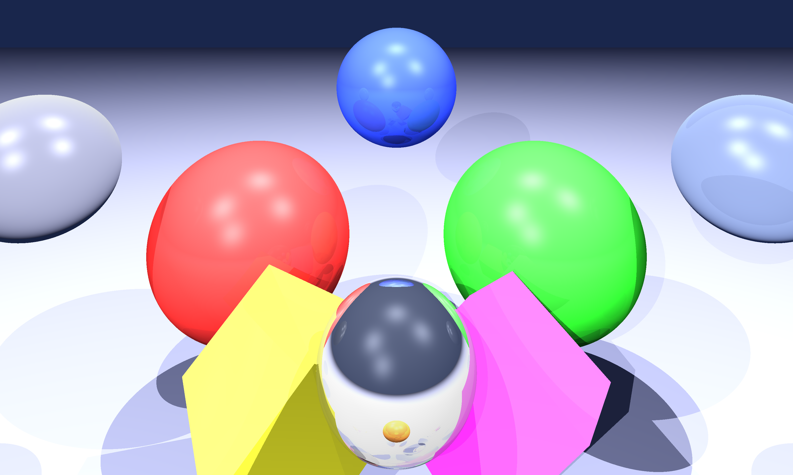
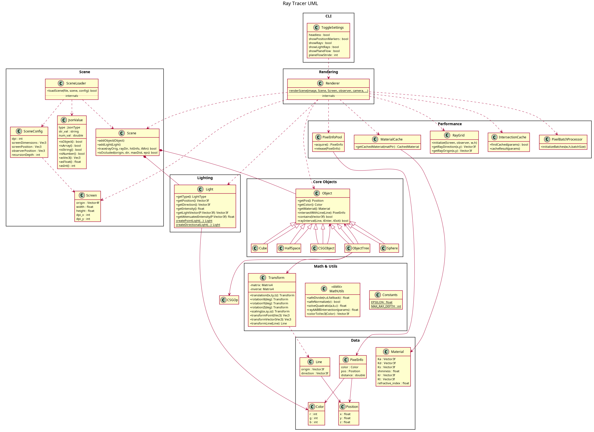

# Ray Tracer

A C++ ray tracing engine with real-time visualization using OpenCV and Eigen.

## Requirements

- **C++17 compiler** (g++, clang++)
- **OpenCV 4** - Image display and processing
- **Eigen 3** - Linear algebra and vector math

## Build & Run

```bash
# Build
make

# Run interactively
./raytrace

## JSON Scene Format

Create custom scenes using JSON files. The program will prompt to load a scene file, or you can specify one.

### Basic Structure

```json
{
    "screen": { /* Camera and viewport settings */ },
    "background": [r, g, b],
    "medium": { /* Global lighting settings */ },
    "sources": [ /* Light sources */ ],
    "objects": [ /* Scene objects */ ]
}
```
### Example Scene 

### Screen Configuration

```json
"screen": {
    "dpi": 320,                    // Resolution density
    "dimensions": [10.0, 6.0],     // Width, height in world units
    "position": [-5, -3, 2],       // Screen center position
    "observer": [0, 4, 8]          // Camera position
}
```

### Lighting

**Background color:**
```json
"background": [0.1, 0.15, 0.3]     // RGB values (0-1)
```

**Global settings:**
```json
"medium": {
    "ambient": [0.25, 0.3, 0.4],   // Ambient light color
    "index": 1.0,                   // Refractive index
    "recursion": 8                  // Max reflection/refraction depth
}
```

**Light sources:**
```json
"sources": [
    {
        "position": [-10, 15, 10],  // Light position
        "intensity": [1.5, 1.2, 1.0] // RGB intensity
    }
]
```

### Objects

**Sphere:**
```json
{
    "sphere": {
        "position": [0, 0, 0],      // Center position
        "radius": 2.0,              // Radius
        "color": { /* Material properties */ }
    }
}
```

**Cube (axis-aligned):**
```json
{
    "cube": {
        "position": [0, 0, 0],      // Center position  
        "size": 2.0,                // Side length
        "color": { /* Material properties */ }
    }
}
```

**Half-space (infinite plane):**
```json
{
    "halfSpace": {
        "position": [0, -4, 0],     // Point on plane
        "normal": [0, 1, 0],        // Normal vector
        "color": { /* Material properties */ }
    }
}
```

### Material Properties

All objects use this material format:
```json
"color": {
    "ambient": [r, g, b],           // Ambient reflection (0-1)
    "diffuse": [r, g, b],           // Diffuse reflection (0-1)  
    "specular": [r, g, b],          // Specular reflection (0-1)
    "reflected": [r, g, b],         // Mirror reflection (0-1)
    "refracted": [r, g, b],         // Transparency (0-1)
    "shininess": 256                // Specular exponent
},
"index": 1.5                        // Refractive index (optional)
```

### Example Scene

```json
{
    "screen": {
        "dpi": 320,
        "dimensions": [8.0, 6.0],
        "position": [-4, -3, 2],
        "observer": [0, 0, 8]
    },
    "background": [0.1, 0.1, 0.2],
    "medium": {
        "ambient": [0.2, 0.2, 0.3],
        "index": 1.0,
        "recursion": 5
    },
    "sources": [
        {
            "position": [5, 10, 5],
            "intensity": [1.0, 1.0, 1.0]
        }
    ],
    "objects": [
        {
            "sphere": {
                "position": [0, 0, 0],
                "radius": 1.5,
                "color": {
                    "ambient": [0.1, 0.1, 0.8],
                    "diffuse": [0.3, 0.3, 1.0],
                    "specular": [1.0, 1.0, 1.0],
                    "reflected": [0.2, 0.2, 0.2],
                    "refracted": [0.0, 0.0, 0.0],
                    "shininess": 128
                }
            }
        }
    ]
}
```
## UML


## Documentation

View comprehensive API documentation:

```bash
# Generate and serve documentation
make docs-serve
# Opens http://localhost:8080

# Or generate only
make docs
```

**Requirements for docs:** Doxygen and Graphviz (auto-installed by `make docs-install`)


